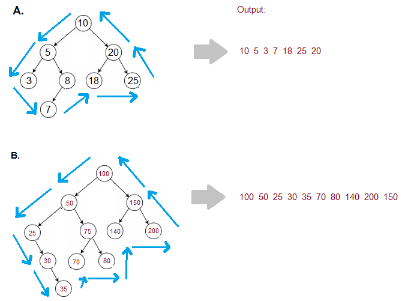

Problem statement
You are given a binary tree having 'n' nodes.

The boundary nodes of a binary tree include the nodes from the left and right boundaries and the leaf nodes, each node considered once.

Figure out the boundary nodes of this binary tree in an Anti-Clockwise direction starting from the root node.

Example :
Input: Consider the binary tree A as shown in the figure:

