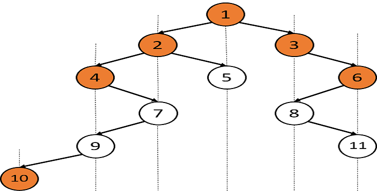

Problem statement
You are given a Binary Tree of 'n' nodes.

The Top view of the binary tree is the set of nodes visible when we see the tree from the top.

Find the top view of the given binary tree, from left to right.

Example :
Input: Let the binary tree be:

Output: [10, 4, 2, 1, 3, 6]

Explanation: Consider the vertical lines in the figure. The top view contains the topmost node from each vertical line.